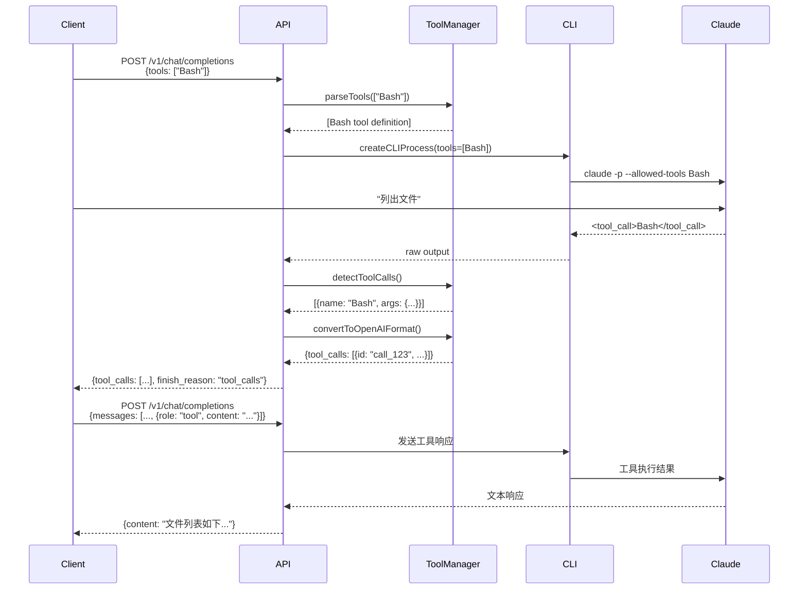
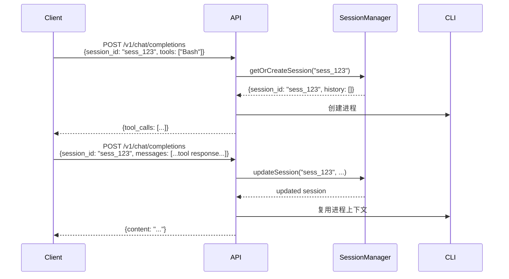

# OpenAI 模式工具调用支持设计文档

> **版本**: 2.0.0
> **创建日期**: 2026-02-05
> **状态**: 🔄 设计中
> **优先级**: P0
> **适用对象**: 架构师、开发者
> **预计完成**: 2026-02-10

---

## 📋 文档概述

本文档定义了在 OpenAI 兼容模式中添加工具调用（Tool Calling）和会话管理支持的完整设计方案。

### 当前状态

**OpenAI 兼容模式 (v1.0.0)**:
- ✅ 基础对话功能
- ✅ 流式和非流式输出
- ✅ System Prompt 支持
- ✅ 多轮对话上下文
- ❌ **不支持工具调用** - 使用 `--tools ''` 禁用
- ❌ **无会话管理** - 每次请求独立

**Agent 模式 (v2.1.0)**:
- ✅ 完整工具调用支持
- ✅ 会话管理
- ❌ 不兼容 OpenAI SDK

### 设计目标

**核心目标**:
1. ✅ **OpenAI 标准兼容** - 完全兼容 OpenAI 工具调用 API
2. ✅ **SDK 无感集成** - 支持主流 OpenAI SDK (Python/JavaScript)
3. ✅ **可选会话管理** - 提供可选的会话持久化
4. ✅ **向后兼容** - 不破坏现有功能
5. ✅ **性能优化** - 最小化性能开销

**非目标**:
- ❌ 替代 Agent 模式 - Agent 模式保留用于复杂场景
- ❌ 强制会话管理 - 保持无状态为默认行为
- ❌ 完全对等 Agent - 功能会有合理限制

---

## 🎯 功能需求

### FR-1: 工具调用支持

OpenAI 模式支持标准的工具调用 API:

```javascript
// 请求格式
POST /v1/chat/completions
{
  "model": "sonnet",
  "messages": [
    { "role": "user", "content": "列出当前目录的文件" }
  ],
  "tools": [
    {
      "type": "function",
      "function": {
        "name": "Bash",
        "description": "Execute bash commands",
        "parameters": {
          "type": "object",
          "properties": {
            "command": { "type": "string", "description": "Command to execute" }
          },
          "required": ["command"]
        }
      }
    }
  ]
}

// 响应格式
{
  "id": "chatcmpl-xxx",
  "choices": [{
    "message": {
      "role": "assistant",
      "tool_calls": [{
        "id": "call_abc123",
        "type": "function",
        "function": {
          "name": "Bash",
          "arguments": "{\"command\":\"ls -la\"}"
        }
      }]
    },
    "finish_reason": "tool_calls"
  }]
}
```

**验收标准**:
- ✅ 支持 `tools` 参数
- ✅ 返回 `tool_calls` 字段
- ✅ 流式和非流式都支持
- ✅ 多个工具调用同时返回
- ✅ 工具调用错误处理

### FR-2: 工具响应提交

支持提交工具执行结果:

```javascript
// 请求格式（包含工具响应）
{
  "model": "sonnet",
  "messages": [
    { "role": "user", "content": "列出当前目录的文件" },
    {
      "role": "assistant",
      "tool_calls": [{
        "id": "call_abc123",
        "type": "function",
        "function": { "name": "Bash", "arguments": "{\"command\":\"ls -la\"}" }
      }]
    },
    {
      "role": "tool",
      "tool_call_id": "call_abc123",
      "content": "total 24\ndrwxr-xr-x  5 user  staff   160 Feb  5 10:00 .\n..."
    }
  ]
}
```

**验收标准**:
- ✅ 支持 `role: "tool"` 消息
- ✅ 关联 `tool_call_id`
- ✅ 正确处理工具响应上下文
- ✅ 支持多个工具调用响应

### FR-3: 可选会话管理

提供可选的会话持久化:

```javascript
// 使用 session_id 启用会话
POST /v1/chat/completions
{
  "model": "sonnet",
  "session_id": "sess_abc123",  // 可选
  "messages": [...],
  "tools": [...]
}
```

**验收标准**:
- ✅ `session_id` 为可选参数
- ✅ 不提供时行为与 v1.0.0 一致
- ✅ 提供时维护会话状态
- ✅ 支持会话查询和删除

### FR-4: 预定义工具集

提供 Claude CLI 工具的标准化定义:

```javascript
// 内置工具定义
const BUILT_IN_TOOLS = {
  Bash: { name: "Bash", description: "Execute shell commands", ... },
  Write: { name: "Write", description: "Write to file", ... },
  Read: { name: "Read", description: "Read file content", ... },
  Edit: { name: "Edit", description: "Edit file", ... },
  Glob: { name: "Glob", description: "Find files by pattern", ... },
  Grep: { name: "Grep", description: "Search file contents", ... }
};

// 客户端可以引用
{
  "tools": ["Bash", "Write", "Read"]  // 简写形式
}
```

**验收标准**:
- ✅ 提供预定义工具定义
- ✅ 支持简写引用
- ✅ 支持自定义工具定义
- ✅ 提供 GET /v1/tools 端点查询可用工具

---

## 🏗️ 技术设计

### 架构变更

#### 当前架构

```
┌─────────────────────────────────┐
│  OpenAI 兼容模式                │
│  /v1/chat/completions           │
└───────────┬─────────────────────┘
            │
            ▼
┌─────────────────────────────────┐
│  CLI Adapter                    │
│  • createCLIProcess()           │
│  • --tools '' (禁用工具)         │
└───────────┬─────────────────────┘
            │
            ▼
┌─────────────────────────────────┐
│  Claude CLI (print mode)        │
└─────────────────────────────────┘
```

#### 新架构 (v2.0.0)

```
┌─────────────────────────────────────────────┐
│  OpenAI 兼容模式                            │
│  /v1/chat/completions                       │
└──────────────────┬──────────────────────────┘
                   │
                   ▼
┌─────────────────────────────────────────────┐
│  Enhanced CLI Adapter                       │
│  • parseTools()           (新增)            │
│  • handleToolCalls()      (新增)            │
│  • optional session support (新增)          │
└──────────────────┬──────────────────────────┘
                   │
         ┌─────────┴─────────┐
         │                   │
         ▼                   ▼
┌─────────────────┐  ┌──────────────────┐
│  Tool Manager   │  │  Session Manager │
│  (新增)         │  │  (可选)          │
└────────┬────────┘  └──────────────────┘
         │
         ▼
┌─────────────────────────────────────────────┐
│  Claude CLI (print mode)                    │
│  • 移除 --tools '' 限制                      │
│  • 解析工具调用输出                          │
└─────────────────────────────────────────────┘
```

### 新增组件

#### 1. Tool Manager (lib/claude/tool-manager.js)

```javascript
/**
 * Tool Manager
 * 管理工具定义、解析和调用
 */
class ToolManager {
  constructor() {
    this.builtInTools = this.initBuiltInTools();
  }

  // 初始化内置工具定义
  initBuiltInTools() {
    return {
      Bash: {
        type: "function",
        function: {
          name: "Bash",
          description: "Execute bash shell commands",
          parameters: {
            type: "object",
            properties: {
              command: {
                type: "string",
                description: "The bash command to execute"
              }
            },
            required: ["command"]
          }
        }
      },
      Write: {
        type: "function",
        function: {
          name: "Write",
          description: "Write content to a file",
          parameters: {
            type: "object",
            properties: {
              file_path: { type: "string", description: "Path to the file" },
              content: { type: "string", description: "Content to write" }
            },
            required: ["file_path", "content"]
          }
        }
      },
      // ... Read, Edit, Glob, Grep
    };
  }

  // 解析工具参数
  parseTools(toolsParam) {
    // 支持简写: ["Bash", "Write"]
    if (Array.isArray(toolsParam)) {
      return toolsParam.map(name => this.builtInTools[name])
        .filter(Boolean);
    }
    // 支持完整定义
    return toolsParam;
  }

  // 检测工具调用
  detectToolCalls(claudeOutput) {
    // 从 Claude CLI 输出中解析工具调用
    const toolCallPattern = /<tool_call>(.*?)<\/tool_call>/s;
    // ...
  }

  // 转换为 OpenAI 格式
  convertToOpenAIFormat(toolCalls) {
    return toolCalls.map(tc => ({
      id: this.generateToolCallId(),
      type: "function",
      function: {
        name: tc.name,
        arguments: JSON.stringify(tc.arguments)
      }
    }));
  }
}
```

#### 2. Enhanced CLI Adapter (lib/adapters/cli-adapter.js)

```javascript
class CLIAdapter {
  constructor(config) {
    // ... 现有代码
    this.toolManager = new ToolManager();
    this.sessionManager = config.enableSessions
      ? new SessionManager()
      : null;
  }

  async processRequest(request) {
    const {
      messages,
      model,
      stream,
      tools,          // 新增
      session_id     // 新增
    } = request;

    // 1. 处理会话
    const session = this.sessionManager
      ? await this.getOrCreateSession(session_id)
      : null;

    // 2. 解析工具定义
    const toolDefinitions = this.toolManager.parseTools(tools);

    // 3. 创建 Claude CLI 进程（移除 --tools '' 限制）
    const { process, processId } = this.processManager.createCLIProcess({
      model,
      stream,
      tools: toolDefinitions,  // 新增
      systemPrompt,
      skipPermissions: true
    });

    // 4. 发送请求
    const result = await this.handleResponse(...);

    // 5. 更新会话
    if (session) {
      this.sessionManager.updateSession(session.sessionId, result);
    }

    return result;
  }

  async handleResponse(process, processId, model, tools) {
    // 检测工具调用
    const toolCalls = this.toolManager.detectToolCalls(output);

    if (toolCalls.length > 0) {
      // 转换为 OpenAI 格式
      const openaiToolCalls = this.toolManager.convertToOpenAIFormat(toolCalls);

      return {
        type: 'tool_calls',
        tool_calls: openaiToolCalls,
        finish_reason: 'tool_calls'
      };
    }

    // 常规文本响应
    return { type: 'content', content: output };
  }
}
```

#### 3. Process Manager 修改

```javascript
// lib/claude/process-manager.js
createCLIProcess(options = {}) {
  const {
    model,
    stream,
    systemPrompt,
    tools,  // 新增
    skipPermissions = true
  } = options;

  const args = [
    '-p',
    '--output-format', stream ? 'stream-json' : 'json',
    '--verbose',
    ...(stream ? ['--include-partial-messages'] : []),
    '--no-session-persistence',
    '--model', model,
    // '--tools', '',  // ← 移除这一行
    ...(skipPermissions ? ['--dangerously-skip-permissions'] : [])
  ];

  // 如果指定了工具，添加 --allowed-tools
  if (tools && tools.length > 0) {
    const toolNames = tools.map(t => t.function.name).join(',');
    args.push('--allowed-tools', toolNames);
  }

  // ... 其余代码
}
```

---

## 📡 API 设计

### 端点 1: POST /v1/chat/completions

增强现有端点，添加工具调用支持。

#### 请求参数

| 参数 | 类型 | 必需 | 描述 |
|------|------|------|------|
| `model` | string | ✅ | 模型名称 |
| `messages` | array | ✅ | 对话消息 |
| `stream` | boolean | ❌ | 是否流式输出 (默认: true) |
| `tools` | array | ❌ | 工具定义（新增） |
| `session_id` | string | ❌ | 会话 ID（新增） |
| `max_tokens` | number | ❌ | 最大 token 数 |
| `stop` | array | ❌ | 停止序列 |

#### tools 参数格式

```javascript
// 完整定义
{
  "tools": [
    {
      "type": "function",
      "function": {
        "name": "Bash",
        "description": "Execute bash commands",
        "parameters": {
          "type": "object",
          "properties": {
            "command": { "type": "string" }
          }
        }
      }
    }
  ]
}

// 简写形式
{
  "tools": ["Bash", "Write", "Read"]
}
```

#### 响应格式（非流式）

**工具调用响应**:
```json
{
  "id": "chatcmpl-abc123",
  "object": "chat.completion",
  "created": 1234567890,
  "model": "claude-sonnet",
  "choices": [{
    "index": 0,
    "message": {
      "role": "assistant",
      "content": null,
      "tool_calls": [{
        "id": "call_xyz789",
        "type": "function",
        "function": {
          "name": "Bash",
          "arguments": "{\"command\":\"ls -la\"}"
        }
      }]
    },
    "finish_reason": "tool_calls"
  }],
  "usage": {
    "prompt_tokens": 20,
    "completion_tokens": 15,
    "total_tokens": 35
  }
}
```

**常规文本响应**:
```json
{
  "choices": [{
    "message": {
      "role": "assistant",
      "content": "好的，我来列出当前目录的文件..."
    },
    "finish_reason": "stop"
  }]
}
```

#### 响应格式（流式）

```
data: {"id":"chatcmpl-abc123","choices":[{"delta":{"role":"assistant"},"finish_reason":null}]}

data: {"id":"chatcmpl-abc123","choices":[{"delta":{"tool_calls":[{"index":0,"id":"call_xyz789","type":"function","function":{"name":"Bash","arguments":""}}]}}]}

data: {"id":"chatcmpl-abc123","choices":[{"delta":{"tool_calls":[{"index":0,"function":{"arguments":"{\"command\":\""}}]}}]}

data: {"id":"chatcmpl-abc123","choices":[{"delta":{"tool_calls":[{"index":0,"function":{"arguments":"ls -la\"}"}}]}}]}

data: {"id":"chatcmpl-abc123","choices":[{"delta":{},"finish_reason":"tool_calls"}]}

data: [DONE]
```

### 端点 2: GET /v1/tools

查询可用的内置工具定义。

#### 响应

```json
{
  "object": "list",
  "data": [
    {
      "name": "Bash",
      "description": "Execute bash shell commands",
      "parameters": { "$ref": "#/components/schemas/BashParameters" }
    },
    {
      "name": "Write",
      "description": "Write content to a file",
      "parameters": { "$ref": "#/components/schemas/WriteParameters" }
    }
  ]
}
```

### 端点 3: POST /v1/sessions

创建会话（可选功能）。

#### 请求

```json
{
  "model": "sonnet",
  "tools": ["Bash", "Write"]
}
```

#### 响应

```json
{
  "id": "sess_abc123",
  "object": "session",
  "created": 1234567890,
  "model": "sonnet",
  "tools": ["Bash", "Write"],
  "status": "active"
}
```

### 端点 4: GET /v1/sessions/:id

获取会话详情。

### 端点 5: DELETE /v1/sessions/:id

删除会话。

---

## 🔄 数据流设计

### 场景 1: 简单工具调用



### 场景 2: 带会话的多轮工具调用



---

## 🧪 测试计划

### 单元测试

**Tool Manager** (`lib/claude/__tests__/tool-manager.test.js`):
- ✅ `parseTools()` - 解析简写和完整定义
- ✅ `detectToolCalls()` - 从输出中检测工具调用
- ✅ `convertToOpenAIFormat()` - 格式转换
- ✅ `generateToolCallId()` - ID 生成唯一性

**CLI Adapter** (`lib/adapters/__tests__/cli-adapter-enhanced.test.js`):
- ✅ `processRequest()` with tools
- ✅ `processRequest()` with session_id
- ✅ `handleToolCalls()` - 工具调用处理
- ✅ 向后兼容性 - 不提供 tools 时行为一致

### 集成测试

**端到端工具调用** (`tests/integration/tool-calling.test.js`):
```javascript
describe('OpenAI Tool Calling', () => {
  test('should return tool_calls in response', async () => {
    const response = await fetch('/v1/chat/completions', {
      method: 'POST',
      body: JSON.stringify({
        model: 'sonnet',
        messages: [{ role: 'user', content: '列出文件' }],
        tools: ['Bash']
      })
    });

    const data = await response.json();
    expect(data.choices[0].message.tool_calls).toBeDefined();
    expect(data.choices[0].finish_reason).toBe('tool_calls');
  });

  test('should handle tool response', async () => {
    const response = await fetch('/v1/chat/completions', {
      method: 'POST',
      body: JSON.stringify({
        model: 'sonnet',
        messages: [
          { role: 'user', content: '列出文件' },
          {
            role: 'assistant',
            tool_calls: [{ id: 'call_123', function: { name: 'Bash', arguments: '{"command":"ls"}' } }]
          },
          { role: 'tool', tool_call_id: 'call_123', content: 'file1.txt\nfile2.txt' }
        ]
      })
    });

    const data = await response.json();
    expect(data.choices[0].message.content).toContain('file1.txt');
  });

  test('should support multiple tool calls', async () => {
    // ...
  });

  test('should work with OpenAI Python SDK', async () => {
    // 使用实际 SDK 测试
  });

  test('should work with OpenAI JavaScript SDK', async () => {
    // 使用实际 SDK 测试
  });
});
```

**会话管理测试** (`tests/integration/session-management.test.js`):
```javascript
describe('Session Management', () => {
  test('should maintain session context', async () => {
    // 第一次请求
    const r1 = await fetch('/v1/chat/completions', {
      body: JSON.stringify({
        session_id: 'sess_test',
        messages: [{ role: 'user', content: '记住：我的名字是 Alice' }]
      })
    });

    // 第二次请求（同一会话）
    const r2 = await fetch('/v1/chat/completions', {
      body: JSON.stringify({
        session_id: 'sess_test',
        messages: [{ role: 'user', content: '我叫什么名字？' }]
      })
    });

    expect(r2.data.choices[0].message.content).toContain('Alice');
  });

  test('should work without session_id', async () => {
    // 验证无会话时行为与 v1.0.0 一致
  });
});
```

### 性能测试

```javascript
describe('Performance', () => {
  test('tool calling overhead < 100ms', async () => {
    // 测量工具调用的额外开销
  });

  test('session management overhead < 50ms', async () => {
    // 测量会话管理的额外开销
  });

  test('concurrent tool calls', async () => {
    // 并发工具调用测试
  });
});
```

---

## 📝 实施计划

### 阶段 1: 基础工具调用 (3天)

**目标**: 实现基本的工具调用支持

**任务**:
- [ ] Day 1.1: 创建 Tool Manager 组件
  - [ ] initBuiltInTools()
  - [ ] parseTools()
  - [ ] detectToolCalls()
  - [ ] 单元测试

- [ ] Day 1.2: 修改 Process Manager
  - [ ] 移除 `--tools ''` 限制
  - [ ] 添加 `--allowed-tools` 支持
  - [ ] 测试 Claude CLI 工具调用

- [ ] Day 1.3: 增强 CLI Adapter
  - [ ] 添加 tools 参数处理
  - [ ] 实现工具调用检测
  - [ ] 转换为 OpenAI 格式
  - [ ] 集成测试

**验收标准**:
- ✅ 简单工具调用测试通过
- ✅ 返回 OpenAI 格式 tool_calls
- ✅ OpenAI SDK 基本集成测试通过

### 阶段 2: 工具响应处理 (2天)

**目标**: 支持提交工具执行结果

**任务**:
- [ ] Day 2.1: 消息格式扩展
  - [ ] 支持 `role: "tool"`
  - [ ] 处理 `tool_call_id`
  - [ ] 构建完整上下文

- [ ] Day 2.2: 多轮对话测试
  - [ ] 单工具多轮调用
  - [ ] 多工具并行调用
  - [ ] 错误处理

**验收标准**:
- ✅ 工具响应正确提交
- ✅ 多轮对话测试通过
- ✅ OpenAI SDK 完整示例通过

### 阶段 3: 会话管理 (2天)

**目标**: 实现可选的会话持久化

**任务**:
- [ ] Day 3.1: Session Manager 集成
  - [ ] 复用现有 Session Manager
  - [ ] 可选启用逻辑
  - [ ] 会话生命周期

- [ ] Day 3.2: 会话 API 端点
  - [ ] POST /v1/sessions
  - [ ] GET /v1/sessions/:id
  - [ ] DELETE /v1/sessions/:id

**验收标准**:
- ✅ 会话管理测试通过
- ✅ 无会话时性能无影响
- ✅ 会话状态正确维护

### 阶段 4: 优化和文档 (2天)

**目标**: 性能优化和文档完善

**任务**:
- [ ] Day 4.1: 性能优化
  - [ ] 工具定义缓存
  - [ ] 会话清理策略
  - [ ] 并发测试

- [ ] Day 4.2: 文档和示例
  - [ ] 更新 API 使用指南
  - [ ] 添加工具调用示例
  - [ ] SDK 集成示例
  - [ ] 迁移指南

**验收标准**:
- ✅ 性能测试通过
- ✅ 文档完整更新
- ✅ 示例代码可运行

### 里程碑

| 里程碑 | 日期 | 交付物 |
|--------|------|--------|
| M1: 基础工具调用 | Day 3 | 基本工具调用功能 |
| M2: 完整对话流程 | Day 5 | 多轮工具调用 |
| M3: 会话管理 | Day 7 | 可选会话持久化 |
| M4: 生产就绪 | Day 9 | 完整功能和文档 |

---

## ⚠️ 风险和限制

### 技术风险

**风险 1: Claude CLI 工具调用输出解析**
- **描述**: Claude CLI 的工具调用输出格式可能不稳定
- **影响**: 中等
- **缓解**:
  - 使用正则和 JSON 解析双重方案
  - 添加详细的错误日志
  - 提供 fallback 到无工具模式

**风险 2: OpenAI SDK 兼容性**
- **描述**: 不同 SDK 对工具调用的实现可能有差异
- **影响**: 中等
- **缓解**:
  - 测试主流 Python 和 JavaScript SDK
  - 提供官方示例代码
  - 文档说明已知兼容性问题

**风险 3: 性能开销**
- **描述**: 工具调用检测和转换可能增加延迟
- **影响**: 低
- **缓解**:
  - 缓存工具定义解析
  - 优化正则表达式
  - 性能基准测试

### 功能限制

**限制 1: 并行工具执行**
- **描述**: OpenAI 模式不会自动执行工具，客户端需自行执行
- **原因**: 保持与 OpenAI API 一致
- **影响**: 客户端需要额外代码
- **建议**: 提供辅助工具函数

**限制 2: 工具定义复杂度**
- **描述**: Claude CLI 工具参数可能与 OpenAI 格式不完全匹配
- **影响**: 需要手动映射某些参数
- **建议**: 提供参数映射配置

**限制 3: 会话持久化**
- **描述**: 会话存储在内存中，重启后丢失
- **影响**: 服务重启会话丢失
- **建议**: 生产环境使用 Redis 或数据库

### 向后兼容性

**保证**:
- ✅ 不提供 `tools` 时，行为与 v1.0.0 完全一致
- ✅ 不提供 `session_id` 时，每次请求独立
- ✅ 现有客户端代码无需修改

**破坏性变更**:
- ❌ 无

---

## 📊 成功指标

### 功能指标

- ✅ 支持至少 6 个 Claude CLI 内置工具
- ✅ 工具调用检测准确率 > 95%
- ✅ OpenAI Python SDK 兼容性 100%
- ✅ OpenAI JavaScript SDK 兼容性 100%

### 性能指标

- ✅ 工具调用额外延迟 < 100ms
- ✅ 会话管理额外延迟 < 50ms
- ✅ 内存开销增长 < 20%

### 质量指标

- ✅ 单元测试覆盖率 > 80%
- ✅ 集成测试通过率 100%
- ✅ 文档完整性 100%

---

## 🔗 相关文档

- [OpenAI API 工具调用文档](https://platform.openai.com/docs/guides/function-calling)
- [Claude CLI 工具文档](https://docs.anthropic.com/claude-code/tools)
- [混合模式设计文档](./hybrid-mode-design.md)
- [Agent 模式实现分析](../reports/agent-mode/AGENT_MODE_ANALYSIS.md)

---

## 📅 版本历史

| 版本 | 日期 | 变更 |
|------|------|------|
| 2.0.0 | 2026-02-05 | 初始设计文档 |
| | | 待实施 |

---

**文档所有者**: Claude CLI Provider 团队
**审核状态**: 待审核
**最后更新**: 2026-02-05

